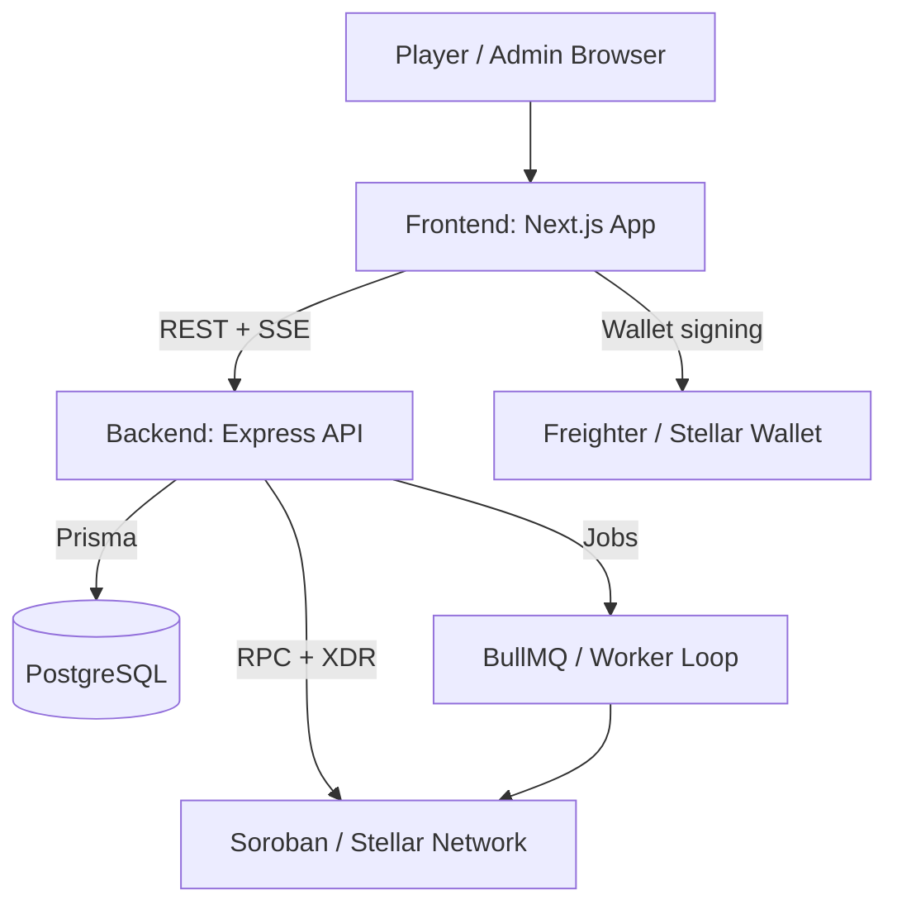
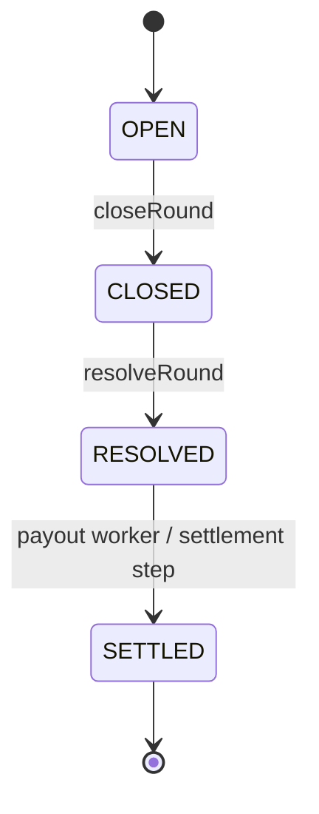
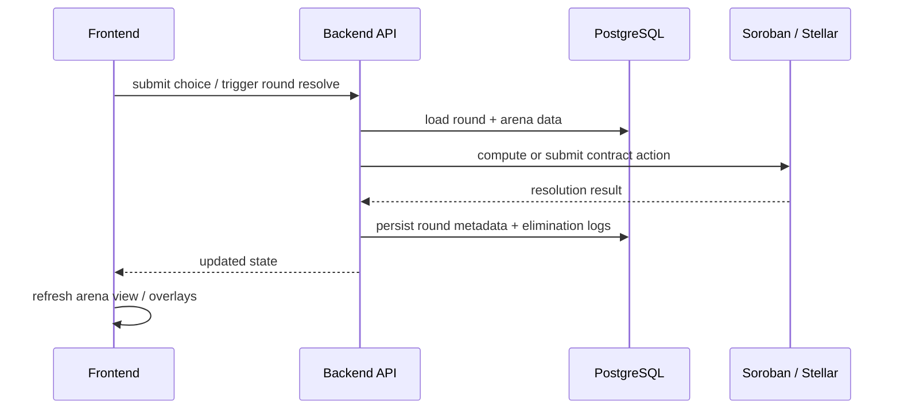
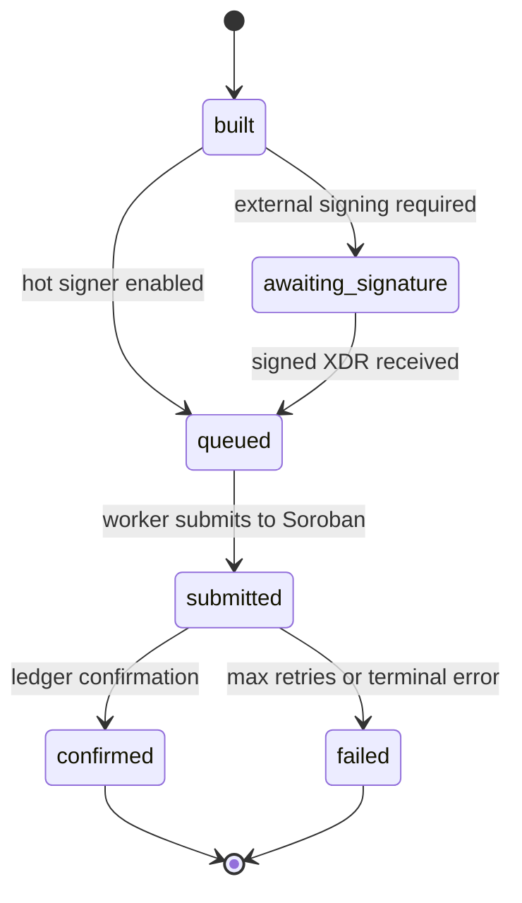
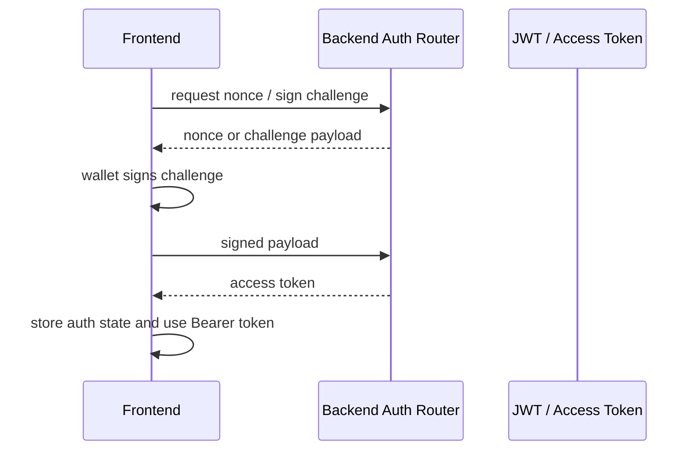
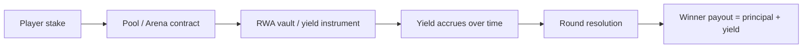
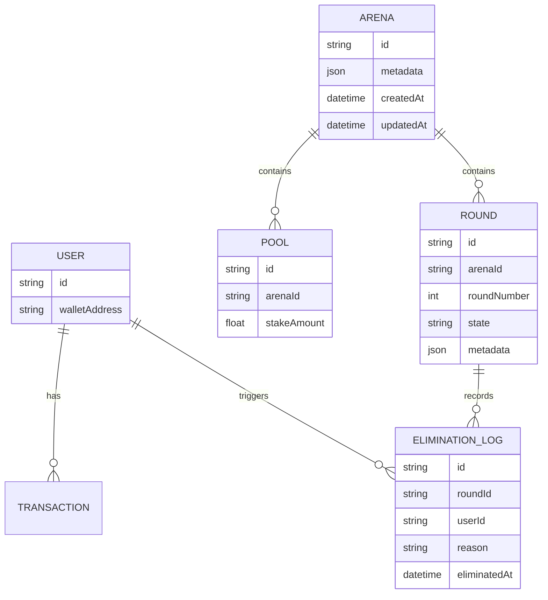

# Architecture

This document summarizes the live architecture of the repository as implemented in the current codebase.

## 1. System Overview

The frontend owns presentation, wallet connection, and client-side state. The backend owns persistence, authorization, round resolution, payout execution, and the arena stream endpoints. Prisma maps the domain objects into PostgreSQL tables.

## 2. Contract State Machine

The current backend round lifecycle is implemented in `backend/src/services/roundService.ts`.

Guards in the service prevent illegal transitions:

- `closeRound` only accepts `OPEN`
- `resolveRound` accepts `OPEN` or `CLOSED`
- settlement is modeled in the schema and docs, and downstream payout processing consumes the resolved result

## 3. Round Resolution Flow

The arena page currently consumes live updates through an SSE stream at `GET /api/arenas/:id/stream` and falls back to local demo data when no demo arena ID is configured.

## 4. Payment Worker Pipeline

The payout flow is implemented around `backend/src/services/paymentService.ts`, the transaction repository, and the worker loop.

The worker uses the configured Soroban RPC client and a circuit breaker so submission failures do not cascade into the rest of the system.

## 5. Auth Flow

The wallet auth path is handled by `backend/src/middleware/auth.ts` and the frontend wallet hook.

`requireAuth` decodes the access token and attaches `req.user.walletAddress`, which is then used by arena and pool creation endpoints.

## 6. RWA Yield Flow

The yield path is described in `docs/RWA_YIELD_FLOW.md` and is reflected in the frontend game copy and backend round statistics.

The backend stores the round and elimination metadata required to reconstruct the yield flow and leaderboard outcomes.

## 7. Data Model

The Prisma schema is defined in `backend/prisma/schema.prisma`.

## Related Files

- [`backend/src/routes/arenas.ts`](backend/src/routes/arenas.ts)
- [`backend/src/services/arenaService.ts`](backend/src/services/arenaService.ts)
- [`backend/src/services/roundService.ts`](backend/src/services/roundService.ts)
- [`backend/src/services/paymentService.ts`](backend/src/services/paymentService.ts)
- [`frontend/src/app/arena/page.tsx`](frontend/src/app/arena/page.tsx)
- [`frontend/src/features/arena/useArenaStream.ts`](frontend/src/features/arena/useArenaStream.ts)
