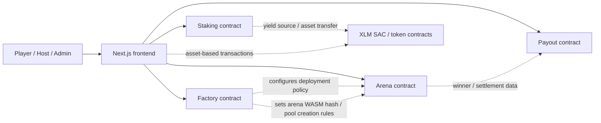
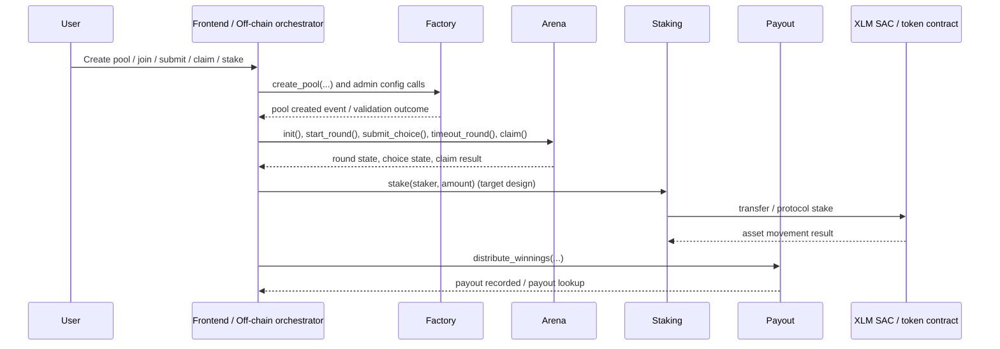
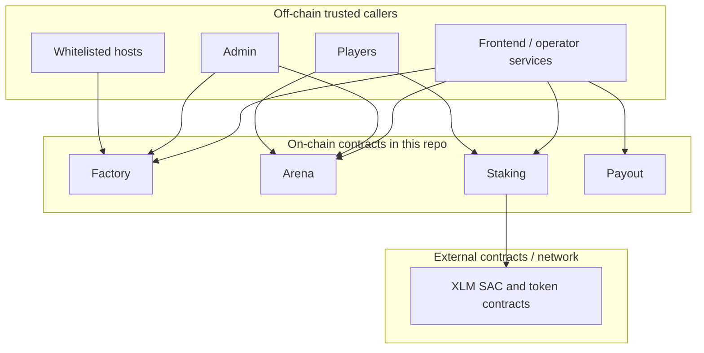

# Inverse Arena Contract Architecture

This document describes how the Soroban contracts in `contract/` fit together, which components trust each other, and where authority lives today.

It is meant to help:
- contributors understand the end-to-end contract flow
- reviewers reason about security boundaries
- frontend and backend developers map client calls to on-chain entrypoints

## Contract Inventory

| Contract | Primary role | Current responsibility |
| --- | --- | --- |
| `factory` | Pool creation and protocol administration | Maintains admin state, host whitelist, arena WASM hash, minimum stake rules, and emits pool creation events |
| `arena` | Round lifecycle and game state | Stores round configuration, player submissions, timeout state, pause flag, admin controls, and upgrade timelock |
| `staking` | Protocol staking | Intended to accept XLM staking deposits and track staker shares; currently still minimal in this repo |
| `payout` | Winnings distribution | Records idempotent payout executions and exposes payout lookup helpers |
| External token contracts | Asset movement | XLM SAC and token contracts used by frontend transaction builders for stake and pool-related flows |

## System Overview

## Inter-Contract Call Diagram

The current codebase is still early-stage: the contracts are mostly coordinated by off-chain callers rather than making many direct cross-contract invocations. The key interaction pattern is therefore orchestrated flow, not deep contract-to-contract execution.

## Data Flow

1. A host or admin uses the `factory` contract to set deployment parameters and create a pool.
2. The frontend treats the resulting arena as the primary gameplay contract and calls `arena` entrypoints for round progression.
3. Players submit choices to `arena`, which stores per-round submissions in persistent storage.
4. After a winner is known, payout handling is expected to move through `payout`, which records idempotent payout execution.
5. Staking-related user flows are expected to route through `staking`, which in turn interacts with XLM or other Stellar asset contracts.

## Trust Boundaries

Trust notes:
- `factory`, `arena`, `staking`, and `payout` are separate contracts with separate storage domains.
- The frontend is a coordinator and must not be treated as an authority boundary by itself; each contract must still enforce auth and state rules on-chain.
- External token contracts are outside this repository and should be treated as integration dependencies, not internal trusted logic.
- Cross-contract assumptions should stay narrow: emit data and persist state explicitly instead of assuming shared storage or implicit trust.

## Ownership And Upgrade Authority

### Factory

- Uses an `ADMIN` instance key.
- The admin can:
  - change admin
  - set the arena WASM hash
  - manage the host whitelist
  - update minimum stake rules
  - propose, execute, and cancel upgrades through the timelock flow

### Arena

- Has a separate `ADMIN` instance key from the factory.
- The admin can:
  - change admin
  - pause and unpause the contract
  - propose, execute, and cancel upgrades
- Gameplay entrypoints like `start_round` and `timeout_round` are intentionally callable by non-admin actors, but still guarded by contract state.

### Payout

- Has its own admin key.
- Winnings distribution is controlled by admin-gated payout execution.

### Staking

- The current contract is still a placeholder, so its final ownership model is not fully implemented yet.
- Based on the architecture direction, it should define admin or operator authority explicitly before handling real funds.

## Authority Model Summary

| Capability | Factory admin | Arena admin | Payout admin | Player | Whitelisted host |
| --- | --- | --- | --- | --- | --- |
| Set or rotate admin | Yes | Yes | Yes | No | No |
| Upgrade contract | Yes | Yes | Not implemented yet | No | No |
| Create pool | Yes | No | No | No | Yes |
| Start or timeout round | No | No special admin requirement | No | Yes, if rules allow | Yes, if rules allow |
| Submit round choice | No | No | No | Yes | No |
| Distribute winnings | No | No | Yes | No | No |
| Stake XLM | No | No | No | Yes | No |

## Pause Exemption Matrix

Emergency pause blocks normal state transitions, but some admin recovery controls are intentionally pause-exempt so incident response can proceed without unpausing first.

| Contract | Functions blocked while paused | Pause-exempt controls |
| --- | --- | --- |
| `arena` | Gameplay state transitions (`join`, `start_round`, `submit_choice`, `timeout_round`, `resolve_round`, `cancel_arena`) | `pause`, `unpause`, `set_token`, `propose_upgrade`, `execute_upgrade`, `cancel_upgrade`, `propose_admin`, `accept_admin`, `cancel_admin_transfer` |
| `factory` | Pool/token policy writes (`create_pool`, `add_supported_token`, `remove_supported_token`, `set_min_stake`, other write paths guarded by `require_not_paused`) | `pause`, `unpause`, `set_admin`, `propose_upgrade`, `execute_upgrade`, `cancel_upgrade`, `propose_admin`, `accept_admin`, `cancel_admin_transfer` |
| `payout` | Payout execution flows (`distribute_winnings`, `distribute_prize`) | `pause`, `unpause`, `set_currency_token`, `set_treasury`, `emergency_recover_tokens`, `propose_upgrade`, `execute_upgrade`, `cancel_upgrade`, `propose_admin`, `accept_admin`, `cancel_admin_transfer` |
| `staking` | User staking/reward flows (`stake`, `unstake`, `deposit_rewards`, `claim_rewards`, `compound`) | `pause`, `unpause`, config/admin endpoints, `propose_upgrade`, `execute_upgrade`, `cancel_upgrade`, `propose_admin`, `accept_admin`, `cancel_admin_transfer` |

Operational note:
- `payout.set_currency_token` is intentionally pause-exempt so compromised currency integrations can be rotated during an active incident.

## Security Review Notes

- The contracts do not currently form a single centralized permission layer; each contract carries its own admin state and must be reviewed independently.
- Upgrade authority is decentralized by contract, which reduces blast radius but increases operational coordination needs.
- The most important trust assumptions are:
  - admin keys are securely managed
  - frontend callers pass the correct contract IDs
  - token contract integrations use the expected Stellar asset contract
- Because some flows are still stubbed or partially implemented, reviewers should distinguish between:
  - current on-chain guarantees already present in code
  - intended future interactions described here for system understanding

## Implementation Status Note

This architecture document reflects the current repository structure as of the contracts present in `contract/`. Some described flows, especially staking and deeper payout orchestration, are target architecture and are not yet fully implemented on-chain.
