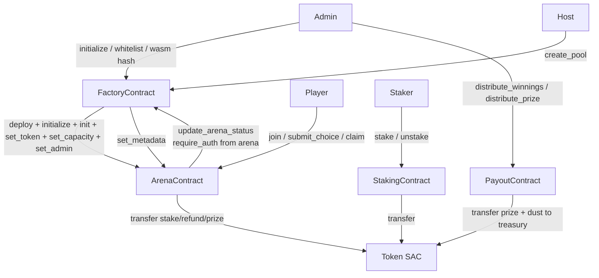

# CONTRACTS.md — InverseArena Soroban Contract Reference

> **Source of truth is the Rust types — this document is a reference guide and may lag behind the source code.**
>
> Generated from the Rust sources under [contract/](.) — specifically:
> - [arena/src/lib.rs](arena/src/lib.rs)
> - [factory/src/lib.rs](factory/src/lib.rs)
> - [payout/src/lib.rs](payout/src/lib.rs)
> - [staking/src/lib.rs](staking/src/lib.rs)

---

## 1. Architecture Overview

InverseArena is composed of four Soroban contracts that together run coin-flip elimination tournaments with an optional yield layer. The **FactoryContract** is the entry point for hosts: it maintains a whitelist, a list of supported currencies, a minimum stake, and a WASM hash used to deploy new arenas. When a host calls `create_pool`, the factory deploys a fresh **ArenaContract** instance and drives its setup (`initialize`, `init`, `init_factory`, `set_token`, `set_capacity`, `set_admin`) via cross-contract calls.

Once deployed, each **ArenaContract** is an independent contract that owns its own state: it accepts `join` calls from players (pulling tokens via the SAC `token::Client`), runs rounds (`start_round` → `submit_choice` / `commit_choice` → `resolve_round`), and settles via `set_winner` + `claim`. The arena can also report state changes back to the factory through `update_arena_status`, which requires the arena contract's own auth.

The **PayoutContract** is a standalone settlement contract addressable by an admin: it records idempotent payouts keyed by `(ctx, pool_id, round_id, winner)` and can distribute a shared prize to a list of winners, sending any integer-division dust to a treasury. The **StakingContract** is an ERC-4626-style share-accounting vault over a single token — callers `stake` to mint shares and `unstake` to burn shares for their proportional token balance. The ArenaContract does **not** invoke the payout or staking contracts directly in the current source; those are coordinated off-chain or by the admin.

---

## 2. ArenaContract

Source: [arena/src/lib.rs](arena/src/lib.rs)

> The arena source currently contains several duplicated items (`cancel_arena`, `leave`, `set_max_rounds`, `is_cancelled`, `FullStateView`, `ArenaMetadata`) that would not compile as-is. The tables below list the `pub fn` symbols as they appear in the source, along with the first / canonical signature.

### Constructor / Initialization

| Function | Parameters | Returns | Description |
|---|---|---|---|
| `initialize` | `env: Env, admin: Address` | `()` | One-shot admin setup. Stores `admin`, sets state to `Pending`, bumps instance TTL. Panics with `"already initialized"` if `ADMIN_KEY` is set. Requires `admin.require_auth()`. |
| `init_factory` | `env: Env, factory: Address, creator: Address` | `()` | Stores the factory address and the original creator. Admin-only. |
| `init` | `env: Env, round_speed_in_ledgers: u32, required_stake_amount: i128, join_deadline: u64` | `Result<(), ArenaError>` | Writes the `ArenaConfig` (round speed, stake, max rounds, winner yield bps, join deadline), initialises `RoundState` and empty `AllPlayers`. Errors: `AlreadyInitialized`, `DeadlineTooSoon` (<1h), `DeadlineTooFar` (>7d), `InvalidRoundSpeed`, `InvalidAmount`. |

### Admin / Configuration

| Function | Parameters | Returns | Description |
|---|---|---|---|
| `admin` | `env: Env` | `Address` | Read admin. Panics if not initialized. |
| `set_admin` | `env: Env, new_admin: Address` | `()` | Rotate admin. Requires current admin auth. |
| `set_token` | `env: Env, token: Address` | `Result<(), ArenaError>` | Set the stake token. Errors: `TokenConfigurationLocked` (once any survivor exists). Admin-only. |
| `set_capacity` | `env: Env, capacity: u32` | `Result<(), ArenaError>` | Set max participants within bounds. Errors: `InvalidCapacity`. Admin-only. |
| `set_winner_yield_share_bps` | `env: Env, bps: u32` | `Result<(), ArenaError>` | Update the winner's yield share (bps). Errors: `InvalidAmount` if `bps > 10_000`. Admin-only. |
| `set_max_rounds` | `env: Env, max_rounds: u32` | `Result<(), ArenaError>` | Update max rounds. Errors: `InvalidMaxRounds`. Admin-only. |
| `set_metadata` | `env: Env, arena_id: u64, name: String, description: Option<String>, host: Address` | `Result<(), ArenaError>` | Store display metadata. Errors: `NameEmpty`, `NameTooLong` (>64), `DescriptionTooLong` (>256). Admin-only. |

### Lifecycle

| Function | Parameters | Returns | Description |
|---|---|---|---|
| `join` | `env: Env, player: Address, amount: i128` | `Result<(), ArenaError>` | Pull `amount` stake tokens, mark player as survivor, emit `PlayerJoined`. Errors: `Paused`, `AlreadyCancelled`, `InvalidAmount` (≠ required stake), `AlreadyJoined`, `ArenaFull`, `TokenNotSet`. Requires `player.require_auth()`. |
| `leave` | `env: Env, player: Address` | `Result<i128, ArenaError>` / `Result<(), ArenaError>` | Refund stake and remove player before round 0 starts. Errors: `NotASurvivor`, `RoundAlreadyActive`, `TokenNotSet`, `Paused`. (Source has two definitions.) |
| `cancel_arena` | `env: Env` | `Result<(), ArenaError>` | Admin cancels a pending/active arena, refunds all current survivors, marks state `Cancelled`. Errors: `Paused`, `AlreadyCancelled`, `GameAlreadyFinished`, `TokenNotSet`. (Source has two definitions; one emits `TOPIC_CANCELLED`.) |
| `expire_arena` | `env: Env` | `Result<(), ArenaError>` | Anyone can call after `join_deadline` passes while state is `Pending`; refunds survivors, emits `ArenaExpired`. Errors: `DeadlineNotReached`, `TokenNotSet`. |
| `is_cancelled` | `env: Env` | `bool` | Read the `CANCELLED` flag. |
| `get_join_deadline` | `env: Env` | `u64` | Read `ArenaConfig.join_deadline`. |

### Rounds

| Function | Parameters | Returns | Description |
|---|---|---|---|
| `start_round` | `env: Env` | `Result<RoundState, ArenaError>` | Open a new round; requires ≥2 survivors. Errors: `Paused`, `RoundAlreadyActive`, `NotEnoughPlayers`, `RoundDeadlineOverflow`. |
| `submit_choice` | `env: Env, player: Address, round_number: u32, choice: Choice` | `Result<(), ArenaError>` | Plaintext submission. Errors: `Paused`, `NoActiveRound`, `WrongRoundNumber`, `SubmissionWindowClosed`, `PlayerEliminated`, `SubmissionAlreadyExists`. |
| `commit_choice` | `env: Env, player: Address, round_number: u32, commitment: BytesN<32>` | `Result<(), ArenaError>` | Commit-phase hash. Errors: `AlreadyCommitted`. |
| `reveal_choice` | `env: Env, player: Address, round_number: u32, choice: Choice, _salt: Bytes` | `Result<(), ArenaError>` | Currently delegates to `submit_choice`. |
| `timeout_round` | `env: Env` | `Result<RoundState, ArenaError>` | Mark round as timed-out after its deadline. Errors: `Paused`, `NoActiveRound`, `RoundStillOpen`. |
| `resolve_round` | `env: Env` | `Result<RoundState, ArenaError>` | Tally votes, eliminate players on the majority side, emit `RSLVD`. Errors: `Paused`, `NoActiveRound`, `RoundStillOpen`. |

### Settlement

| Function | Parameters | Returns | Description |
|---|---|---|---|
| `set_winner` | `env: Env, player: Address, principal_pool: i128, yield_earned: i128` | `Result<(), ArenaError>` | Admin books winner and yield split. Emits `YieldDistributed`. Errors: `WinnerAlreadySet`, `InvalidAmount`. |
| `claim` | `env: Env, player: Address` | `Result<i128, ArenaError>` | Winner / yield-share claim. Transfers tokens. Errors: `NoPrizeToClaim`, `AlreadyClaimed`. |

### Views

| Function | Parameters | Returns | Description |
|---|---|---|---|
| `get_config` | `env: Env` | `Result<ArenaConfig, ArenaError>` | Read config. Errors: `NotInitialized`. |
| `get_round` | `env: Env` | `Result<RoundState, ArenaError>` | Read current round. Errors: `NotInitialized`. |
| `get_choice` | `env: Env, round_number: u32, player: Address` | `Option<Choice>` | Read a submitted choice. |
| `get_arena_state` | `env: Env` | `Result<ArenaStateView, ArenaError>` | Aggregate arena view. |
| `get_user_state` | `env: Env, player: Address` | `UserStateView` | Per-player flags. |
| `get_full_state` | `env: Env, player: Address` | `Result<FullStateView, ArenaError>` | Combined view. |
| `get_metadata` | `env: Env, arena_id: u64` | `Option<ArenaMetadata>` | Read metadata record. |
| `state` | `env: Env` | `ArenaState` | Current lifecycle state. |

### Pause / Upgrade

| Function | Parameters | Returns | Description |
|---|---|---|---|
| `pause` | `env: Env` | `()` | Admin sets `PAUSED`, emits `PAUSED`. |
| `unpause` | `env: Env` | `()` | Admin clears `PAUSED`, emits `UNPAUSED`. |
| `is_paused` | `env: Env` | `bool` | |
| `propose_upgrade` | `env: Env, new_wasm_hash: BytesN<32>` | `Result<(), ArenaError>` | Stages new WASM hash with a 48h timelock. Errors: `UpgradeAlreadyPending`. |
| `execute_upgrade` | `env: Env` | `Result<(), ArenaError>` | Apply upgrade after timelock. Errors: `NoPendingUpgrade`, `TimelockNotExpired`. |
| `cancel_upgrade` | `env: Env` | `Result<(), ArenaError>` | Cancel a staged upgrade. Errors: `NoPendingUpgrade`. |
| `pending_upgrade` | `env: Env` | `Option<(BytesN<32>, u64)>` | Read pending hash + earliest exec timestamp. |

### Error Codes (`ArenaError`)

| Code | Name | Description |
|---:|---|---|
| 1 | `AlreadyInitialized` | `initialize`/`init` called on a contract that already has state |
| 2 | `InvalidRoundSpeed` | `round_speed_in_ledgers` is 0 or exceeds `MAX_SPEED_LEDGERS` |
| 3 | `RoundAlreadyActive` | A round is already active |
| 4 | `NoActiveRound` | No round is active |
| 5 | `SubmissionWindowClosed` | Ledger past round deadline |
| 6 | `SubmissionAlreadyExists` | Player already submitted this round |
| 7 | `RoundStillOpen` | Round deadline not yet reached |
| 8 | `RoundDeadlineOverflow` | Deadline ledger computation overflowed |
| 9 | `NotInitialized` | `ArenaConfig` / `RoundState` missing |
| 10 | `Paused` | Contract paused |
| 11 | `ArenaFull` | Survivor count at capacity |
| 12 | `AlreadyJoined` | Player already joined |
| 13 | `InvalidAmount` | Amount does not match required stake or is out of bounds |
| 14 | `NoPrizeToClaim` | Nothing to claim |
| 15 | `AlreadyClaimed` | Player already claimed |
| 16 | `ReentrancyGuard` | Reentrancy detected (reserved) |
| 17 | `NotASurvivor` | Player is not in the survivor set |
| 18 | `GameAlreadyFinished` | Arena already completed |
| 19 | `TokenNotSet` | `set_token` not yet called |
| 20 | `MaxSubmissionsPerRound` | Per-round submission cap reached (reserved) |
| 21 | `PlayerEliminated` | Player already eliminated |
| 22 | `WrongRoundNumber` | `round_number` arg ≠ current round |
| 23 | `NotEnoughPlayers` | Fewer than 2 survivors |
| 24 | `InvalidCapacity` | Capacity out of `MIN..=MAX_ARENA_PARTICIPANTS` |
| 25 | `NoPendingUpgrade` | No upgrade proposal to act on |
| 26 | `TimelockNotExpired` | Upgrade timelock still active |
| 27 | `GameNotFinished` | Action requires completed state |
| 28 | `TokenConfigurationLocked` | Token cannot change once survivors exist |
| 29 | `UpgradeAlreadyPending` | Another upgrade already staged |
| 30 | `WinnerAlreadySet` | Winner already booked |
| 31 | `WinnerNotSet` | Winner not yet booked |
| 32 | `AlreadyCancelled` | Arena already cancelled |
| 33 | `InvalidMaxRounds` | Out of `MIN_MAX_ROUNDS..=MAX_MAX_ROUNDS` |
| 34 | `NameTooLong` | Metadata name > 64 bytes |
| 35 | `NameEmpty` | Metadata name length 0 |
| 36 | `DescriptionTooLong` | Metadata description > 256 bytes |
| 37 | `NoCommitment` | Reveal without commitment (reserved) |
| 38 | `CommitmentMismatch` | Reveal does not match commitment (reserved) |
| 39 | `RevealDeadlinePassed` | Reveal window closed (reserved) |
| 40 | `CommitDeadlinePassed` | Commit window closed (reserved) |
| 41 | `AlreadyCommitted` | Duplicate commitment |
| 42 | `DeadlineTooSoon` | `join_deadline` < now + 1h |
| 43 | `DeadlineTooFar` | `join_deadline` > now + 7d |
| 44 | `DeadlineNotReached` | `expire_arena` called before join deadline |

### Events Emitted

| Event | Topics | Data | Description |
|---|---|---|---|
| PlayerJoined | `[Symbol("P_JOIN"), arena_id]` | `PlayerJoined { arena_id: u64, player: Address, entry_fee: i128 }` | Emitted on successful `join`. |
| RoundResolved | `[Symbol("RSLVD")]` | `(round_number: u32, heads: u32, tails: u32, eliminated_count: u32)` | Emitted by `resolve_round`. |
| YieldDistributed | `[Symbol("Y_DIST")]` | `YieldDistributed { winner_yield: i128, eliminated_yield: i128, eliminated_count: u32 }` | Emitted by `set_winner`. |
| ArenaCancelled | `[Symbol("CANCELLED")]` | `(EVENT_VERSION: u32,)` | Emitted by `cancel_arena`. |
| ArenaExpired | `[Symbol("A_EXP")]` | `ArenaExpired { arena_id: u64, refunded_players: u32 }` | Emitted by `expire_arena`. |
| Paused | `[Symbol("PAUSED")]` | `()` | Emitted by `pause`. |
| Unpaused | `[Symbol("UNPAUSED")]` | `()` | Emitted by `unpause`. |

---

## 3. FactoryContract

Source: [factory/src/lib.rs](factory/src/lib.rs)

### Constructor / Admin

| Function | Parameters | Returns | Description |
|---|---|---|---|
| `initialize` | `env: Env, admin: Address` | `Result<(), Error>` | One-shot admin setup. Writes `ADMIN_KEY`, `DEFAULT_MIN_STAKE`, `CURRENT_SCHEMA_VERSION`. Errors: `AlreadyInitialized`. |
| `schema_version` | `env: Env` | `u32` | Persisted schema version (0 if unset). |
| `migrate` | `env: Env` | `Result<(), Error>` | Admin-only; run forward migrations up to `CURRENT_SCHEMA_VERSION`. |
| `admin` | `env: Env` | `Result<Address, Error>` | Read admin. Errors: `NotInitialized`. |
| `set_admin` | `env: Env, new_admin: Address` | `Result<(), Error>` | Rotate admin; emits `ADM_CHG`. |
| `set_arena_wasm_hash` | `env: Env, wasm_hash: BytesN<32>` | `Result<(), Error>` | Store WASM hash used by `create_pool`; emits `WASM_UP`. |

### Whitelist / Tokens / Min Stake

| Function | Parameters | Returns | Description |
|---|---|---|---|
| `add_to_whitelist` | `env: Env, host: Address` | `Result<(), Error>` | Emits `WL_ADD`. Admin-only. |
| `remove_from_whitelist` | `env: Env, host: Address` | `Result<(), Error>` | Emits `WL_REM`. Admin-only. |
| `is_whitelisted` | `env: Env, host: Address` | `Result<bool, Error>` | |
| `add_supported_token` | `env: Env, token: Address` | `Result<(), Error>` | Emits `TOK_ADD`. Admin-only. |
| `remove_supported_token` | `env: Env, token: Address` | `Result<(), Error>` | Emits `TOK_REM`. Admin-only. Existing pools are unaffected. |
| `is_token_supported` | `env: Env, token: Address` | `bool` | |
| `set_min_stake` | `env: Env, min_stake: i128` | `Result<(), Error>` | Emits `MIN_UP`. Errors: `InvalidStakeAmount`, `Paused`. |
| `get_min_stake` | `env: Env` | `i128` | Returns `DEFAULT_MIN_STAKE` (10 XLM in stroops) when unset. |

### Pool Deployment

| Function | Parameters | Returns | Description |
|---|---|---|---|
| `create_pool` | `env: Env, caller: Address, stake: i128, currency: Address, round_speed: u32, capacity: u32, join_deadline: u64` | `Result<Address, Error>` | Deploys a new ArenaContract and drives its setup. Errors: `Unauthorized`, `UnsupportedToken`, `InvalidCapacity`, `InvalidStakeAmount`, `StakeBelowMinimum`, `WasmHashNotSet`, `Paused`. Emits `POOL_CRE`. Cross-contract calls into the new arena: `initialize`, `init`, `init_factory`, `set_token`, `set_capacity`, `set_admin`. |
| `set_arena_metadata` | `env: Env, arena_address: Address, arena_id: u64, name: String, description: Option<String>, host: Address` | `()` | Forwards to `ArenaContract::set_metadata` and records `ArenaRef { contract, status: Pending }`. |
| `get_arena_ref` | `env: Env, arena_id: u64` | `Result<ArenaRef, Error>` | Errors: `ArenaNotFound`. |
| `update_arena_status` | `env: Env, arena_id: u64, status: ArenaStatus` | `Result<(), Error>` | Only the recorded arena contract can call (enforced via `arena_ref.contract.require_auth()`). |
| `get_arena` | `env: Env, pool_id: u32` | `Option<ArenaMetadata>` | |
| `get_arenas` | `env: Env, offset: u32, limit: u32` | `Vec<ArenaMetadata>` | Paginated; `limit` clamped to `MAX_PAGE_SIZE` (50). |

### Upgrade Mechanism

| Function | Parameters | Returns | Description |
|---|---|---|---|
| `propose_upgrade` | `env: Env, new_wasm_hash: BytesN<32>` | `Result<(), Error>` | 48h timelock. Errors: `UpgradeAlreadyPending`. Emits `UP_PROP`. |
| `execute_upgrade` | `env: Env` | `Result<(), Error>` | Errors: `NoPendingUpgrade`, `MalformedUpgradeState`, `TimelockNotExpired`. Emits `UP_EXEC`. |
| `cancel_upgrade` | `env: Env` | `Result<(), Error>` | Errors: `NoPendingUpgrade`. Emits `UP_CANC`. |
| `pending_upgrade` | `env: Env` | `Option<(BytesN<32>, u64)>` | |

### Pause

| Function | Parameters | Returns | Description |
|---|---|---|---|
| `pause` | `env: Env` | `Result<(), Error>` | Admin-only. Emits `PAUSED`. |
| `unpause` | `env: Env` | `Result<(), Error>` | Admin-only. Emits `UNPAUSED`. |
| `is_paused` | `env: Env` | `bool` | |

### Error Codes (`Error`)

| Code | Name | Description |
|---:|---|---|
| 1 | `NotInitialized` | Contract has not been initialised |
| 2 | `AlreadyInitialized` | `initialize` called twice |
| 3 | `Unauthorized` | Caller lacks permission |
| 4 | `NoPendingUpgrade` | No upgrade proposal exists |
| 5 | `TimelockNotExpired` | `execute_upgrade` before 48h elapsed |
| 6 | `StakeBelowMinimum` | `stake < min_stake` |
| 7 | `HostNotWhitelisted` | Caller not whitelisted |
| 8 | `InvalidStakeAmount` | Stake ≤ 0 |
| 9 | `PoolAlreadyExists` | Duplicate `pool_id` |
| 10 | `InvalidCapacity` | Capacity < 2 or > `MAX_POOL_CAPACITY` (256) |
| 11 | `WasmHashNotSet` | `set_arena_wasm_hash` not called |
| 12 | `MalformedUpgradeState` | Pending hash/after stored inconsistently |
| 13 | `UnsupportedToken` | `currency` not in supported list |
| 14 | `UpgradeAlreadyPending` | Previous proposal still open |
| 15 | `Paused` | Contract paused |
| 16 | `ArenaNotFound` | `ArenaRef` for `arena_id` missing |

### Events Emitted

| Event | Topics | Data | Description |
|---|---|---|---|
| AdminChanged | `[Symbol("ADM_CHG")]` | `(EVENT_VERSION: u32, old_admin: Address, new_admin: Address)` | `set_admin` |
| WasmUpdated | `[Symbol("WASM_UP")]` | `(EVENT_VERSION: u32, previous_hash: Option<BytesN<32>>, new_hash: BytesN<32>)` | `set_arena_wasm_hash` |
| HostWhitelisted | `[Symbol("WL_ADD")]` | `(EVENT_VERSION: u32, host: Address)` | `add_to_whitelist` |
| HostRemoved | `[Symbol("WL_REM")]` | `(EVENT_VERSION: u32, host: Address)` | `remove_from_whitelist` |
| MinStakeUpdated | `[Symbol("MIN_UP")]` | `(EVENT_VERSION: u32, previous: i128, new: i128)` | `set_min_stake` |
| PoolCreated | `[Symbol("POOL_CRE")]` | `(EVENT_VERSION: u32, pool_id: u32, creator: Address, capacity: u32, stake: i128, arena_address: Address)` | `create_pool` |
| TokenAdded | `[Symbol("TOK_ADD")]` | `(EVENT_VERSION: u32, false, true, token: Address)` | `add_supported_token` |
| TokenRemoved | `[Symbol("TOK_REM")]` | `(EVENT_VERSION: u32, token: Address)` | `remove_supported_token` |
| UpgradeProposed | `[Symbol("UP_PROP")]` | `(EVENT_VERSION: u32, new_wasm_hash: BytesN<32>, execute_after: u64)` | `propose_upgrade` |
| UpgradeExecuted | `[Symbol("UP_EXEC")]` | `(EVENT_VERSION: u32, new_wasm_hash: BytesN<32>)` | `execute_upgrade` |
| UpgradeCancelled | `[Symbol("UP_CANC")]` | `(EVENT_VERSION: u32,)` | `cancel_upgrade` |
| Paused | `[Symbol("PAUSED")]` | `(EVENT_VERSION: u32,)` | `pause` |
| Unpaused | `[Symbol("UNPAUSED")]` | `(EVENT_VERSION: u32,)` | `unpause` |

---

## 4. PayoutContract

Source: [payout/src/lib.rs](payout/src/lib.rs)

### Constructor / Admin

| Function | Parameters | Returns | Description |
|---|---|---|---|
| `hello` | `_env: Env` | `u32` | Liveness probe; returns `789`. |
| `initialize` | `env: Env, admin: Address` | `()` | One-shot. Panics if already initialized. |
| `init_factory` | `env: Env, factory: Address, admin: Address` | `()` | Alternate initializer called by the factory (requires `factory.require_auth()`). Panics if already initialized. |
| `admin` | `env: Env` | `Address` | Panics if not initialized. |
| `set_treasury` | `env: Env, treasury: Address` | `()` | Admin-only. |
| `treasury` | `env: Env` | `Result<Address, PayoutError>` | Errors: `TreasuryNotSet`. |
| `set_currency_token` | `env: Env, symbol: Symbol, token_address: Address` | `()` | Register the SAC address for a currency symbol. Admin-only. Panics with `Paused` if paused. |

### Distribution

| Function | Parameters | Returns | Description |
|---|---|---|---|
| `distribute_winnings` | `env: Env, ctx: Symbol, pool_id: u32, round_id: u32, winner: Address, amount: i128, currency: Symbol` | `Result<(), PayoutError>` | Idempotent on `(ctx, pool_id, round_id, winner)`. Transfers tokens if a currency token is registered and appends a `PayoutReceipt`. Errors: `Paused`, `InvalidAmount` (panic), `AlreadyPaid` (panic). Admin-only. |
| `is_payout_processed` | `env: Env, ctx: Symbol, pool_id: u32, round_id: u32, winner: Address` | `bool` | |
| `get_payout` | `env: Env, ctx: Symbol, pool_id: u32, round_id: u32, winner: Address` | `Option<PayoutData>` | |
| `distribute_prize` | `env: Env, game_id: u32, total_prize: i128, winners: Vec<Address>, currency: Address` | `Result<(), PayoutError>` | Splits `total_prize` evenly across `winners`; any remainder (`dust`) is sent to treasury. Idempotent on `game_id`. Errors: `Paused`, `AlreadyPaid`, `InvalidAmount`, `NoWinners`, `TreasuryNotSet`. Admin-only. |
| `get_payout_history` | `env: Env, cursor: Option<u64>, limit: u32` | `PayoutPage` | Paginates `PayoutReceipt`s (`limit` clamped to 100). |
| `get_payout_by_arena` | `env: Env, arena_id: u64` | `Option<PayoutReceipt>` | |
| `is_prize_distributed` | `env: Env, game_id: u32` | `bool` | |

### Pause

| Function | Parameters | Returns | Description |
|---|---|---|---|
| `pause` | `env: Env` | `()` | Admin-only. Emits `PAUSED`. |
| `unpause` | `env: Env` | `()` | Admin-only. Emits `UNPAUSED`. |
| `is_paused` | `env: Env` | `bool` | |

### Error Codes (`PayoutError`)

| Code | Name | Description |
|---:|---|---|
| 1 | `UnauthorizedCaller` | Caller is not admin |
| 2 | `InvalidAmount` | Amount ≤ 0 |
| 3 | `AlreadyPaid` | Payout or prize key already processed |
| 4 | `NoWinners` | `distribute_prize` with empty list |
| 5 | `TreasuryNotSet` | `TREASURY_KEY` not configured |
| 6 | `Paused` | Contract paused |

### Events Emitted

| Event | Topics | Data | Description |
|---|---|---|---|
| PayoutExecuted | `[Symbol("PAYOUT")]` | `(winner: Address, amount: i128, currency: Symbol \| Address)` | One per winner (both in `distribute_winnings` and for each winner in `distribute_prize`). |
| DustCollected | `[Symbol("DUST")]` | `(treasury: Address, dust: i128, currency: Address)` | Only when `distribute_prize` has a non-zero integer-division remainder. |
| Paused | `[Symbol("PAUSED")]` | `()` | |
| Unpaused | `[Symbol("UNPAUSED")]` | `()` | |

---

## 5. StakingContract

Source: [staking/src/lib.rs](staking/src/lib.rs)

### Constructor / Admin

| Function | Parameters | Returns | Description |
|---|---|---|---|
| `hello` | `_env: Env` | `u32` | Liveness probe; returns `101112`. |
| `initialize` | `env: Env, admin: Address, token: Address` | `()` | One-shot. Panics if already initialized. Requires `admin.require_auth()`. |
| `admin` | `env: Env` | `Address` | Panics if not initialized. |
| `token` | `env: Env` | `Address` | Staking token address. Panics if not initialized. |

### Pause

| Function | Parameters | Returns | Description |
|---|---|---|---|
| `pause` | `env: Env` | `()` | Admin-only. Emits `PAUSED`. |
| `unpause` | `env: Env` | `()` | Admin-only. Sets `PAUSED_KEY=false`. Emits `UNPAUSED`. |
| `is_paused` | `env: Env` | `bool` | |

### Queries

| Function | Parameters | Returns | Description |
|---|---|---|---|
| `total_staked` | `env: Env` | `i128` | Total deposited tokens. |
| `total_shares` | `env: Env` | `i128` | Total outstanding shares. |
| `get_position` | `env: Env, staker: Address` | `StakePosition` | Returns zeros when no position. |
| `staked_balance` | `env: Env, staker: Address` | `i128` | Convenience; `get_position(...).amount`. |
| `get_staker_stats` | `env: Env, staker: Address` | `StakerStats` | Includes `stake_share_bps = position.amount * 10_000 / total_staked`. |

### Staking Actions

| Function | Parameters | Returns | Description |
|---|---|---|---|
| `stake` | `env: Env, staker: Address, amount: i128` | `Result<i128, StakingError>` | Mints shares = `amount` (empty pool) or `amount * total_shares / total_staked`. Updates state before transferring tokens in (CEI). Emits `STAKED`. Errors: `Paused`, `NotInitialized`, `InvalidAmount`. |
| `unstake` | `env: Env, staker: Address, shares: i128` | `Result<i128, StakingError>` | Returns `shares * total_staked / total_shares` tokens. Updates state before transferring tokens out. Emits `UNSTAKED`. Errors: `Paused`, `NotInitialized`, `ZeroShares`, `InvalidAmount`, `InsufficientShares`. |

### Error Codes (`StakingError`)

| Code | Name | Description |
|---:|---|---|
| 1 | `NotInitialized` | `TOKEN_KEY` unset |
| 2 | `AlreadyInitialized` | (reserved — `initialize` panics) |
| 3 | `Paused` | Contract paused |
| 4 | `InvalidAmount` | Negative stake / negative shares |
| 5 | `InsufficientShares` | `shares > position.shares` |
| 6 | `ZeroShares` | `unstake(0)` |

### Events Emitted

| Event | Topics | Data | Description |
|---|---|---|---|
| Staked | `[Symbol("STAKED")]` | `(staker: Address, amount: i128, shares_minted: i128)` | `stake` |
| Unstaked | `[Symbol("UNSTAKED")]` | `(staker: Address, tokens_returned: i128, shares: i128)` | `unstake` |
| Paused | `[Symbol("PAUSED")]` | `()` | `pause` |
| Unpaused | `[Symbol("UNPAUSED")]` | `()` | `unpause` |

---

## 6. Storage Layout

Soroban contracts use three storage spaces — `instance`, `persistent`, and `temporary`. Below, entries keyed by a short `Symbol` live in instance storage; entries keyed by a `DataKey` variant live in persistent or instance storage as noted.

### ArenaContract

#### Instance `Symbol` keys

| Key | Type | Description |
|---|---|---|
| `ADMIN` | `Address` | Contract admin |
| `TOKEN` | `Address` | Stake token SAC |
| `CAPACITY` | `u32` | Max participants (defaults to `MAX_ARENA_PARTICIPANTS`) |
| `POOL` | `i128` | Accumulated principal prize pool |
| `YIELD` | `i128` | Booked yield earned |
| `WY_BPS` | `u32` | Winner yield share (bps) |
| `S_COUNT` | `u32` | Surviving player count |
| `CANCEL` | `bool` | Cancellation flag |
| `PAUSED` | `bool` | Pause flag |
| `P_HASH` | `BytesN<32>` | Pending upgrade WASM hash |
| `P_AFTER` | `u64` | Upgrade earliest-execute timestamp |
| `STATE` | `ArenaState` | Lifecycle state |
| `WINNER` | `Address` | Winner address once set |
| `FACTORY` | `Address` | Deploying factory |
| `CREATOR` | `Address` | Original pool creator |

#### `DataKey` variants

| Variant | Storage | Type Stored | Description |
|---|---|---|---|
| `Config` | instance | `ArenaConfig` | Round speed, stake, max rounds, winner bps, join deadline |
| `Round` | instance | `RoundState` | Current round |
| `Submission(u32, Address)` | persistent | `Choice` | Plaintext submission |
| `Commitment(u32, Address)` | persistent | `BytesN<32>` | Commit-phase hash |
| `RoundPlayers(u32)` | persistent | `Vec<Address>` | Players who submitted this round |
| `AllPlayers` | persistent | `Vec<Address>` | All joined players |
| `Survivor(Address)` | persistent | `bool` | Player is still alive |
| `Eliminated(Address)` | persistent | `bool` | Player was eliminated |
| `PrizeClaimed(Address)` | persistent | `i128` | Record of amount claimed |
| `Claimable(Address)` | persistent | `i128` | Currently claimable amount |
| `Winner(Address)` | persistent | `bool` | Player is the arena winner |
| `Refunded(Address)` | persistent | `()` | Refund already issued (cancel / expire) |
| `Metadata(u64)` | persistent | `ArenaMetadata` | Display metadata |

### FactoryContract

#### Instance `Symbol` keys

| Key | Type | Description |
|---|---|---|
| `ADMIN` | `Address` | Factory admin |
| `P_HASH` | `BytesN<32>` | Pending upgrade hash |
| `P_AFTER` | `u64` | Upgrade earliest-execute timestamp |
| `(WL, Address)` | `bool` | Host whitelist entries |
| `MIN_STK` | `i128` | Minimum stake (defaults to 10 XLM in stroops) |
| `AR_WASM` | `BytesN<32>` | Arena WASM hash used by `create_pool` |
| `P_CNT` | `u32` | Pool counter (next `pool_id`) |
| `S_VER` | `u32` | Schema version |
| `PAUSED` | `bool` | Pause flag |

#### `DataKey` variants

| Variant | Storage | Type Stored | Description |
|---|---|---|---|
| `SupportedToken(Address)` | instance | `bool` | Approved currency list |
| `Pool(u32)` | persistent | `ArenaMetadata` | Per-pool metadata |
| `ArenaRef(u64)` | persistent | `ArenaRef { contract, status }` | Deployed arena + lifecycle status |

### PayoutContract

#### Instance `Symbol` keys

| Key | Type | Description |
|---|---|---|
| `ADMIN` | `Address` | Admin |
| `TREAS` | `Address` | Treasury address |
| `PAUSED` | `bool` | Pause flag |
| `P_COUNT` | `u64` | Running payout receipt index |

#### `DataKey` variants

| Variant | Storage | Type Stored | Description |
|---|---|---|---|
| `CurrencyToken(Symbol)` | instance | `Address` | Token SAC for a currency symbol |
| `Payout(Symbol, u32, u32, Address)` | persistent | `PayoutData` | Per-winner idempotency record (`ctx, pool_id, round_id, winner`) |
| `PrizePayout(u32)` | instance | `bool` | Idempotency flag for `distribute_prize(game_id)` |
| `PayoutHistory(u64)` | persistent | `PayoutReceipt` | Ordered receipt log |
| `ArenaPayout(u64)` | persistent | `PayoutReceipt` | Receipt keyed by `arena_id` |

### StakingContract

#### Instance `Symbol` keys

| Key | Type | Description |
|---|---|---|
| `ADMIN` | `Address` | Admin |
| `PAUSED` | `bool` | Pause flag |
| `TOKEN` | `Address` | Staking token SAC |
| `TSTAKE` | `i128` | Total tokens staked |
| `TSHARES` | `i128` | Total outstanding shares |

#### `DataKey` variants

| Variant | Storage | Type Stored | Description |
|---|---|---|---|
| `Position(Address)` | persistent | `StakePosition { amount, shares }` | Per-staker position |

---

## 7. Event Schema

Every `env.events().publish(...)` call across the four contracts. Topic strings are the underlying `symbol_short!` values.

| Contract | Event Name | Topic Format | Data Fields | When Emitted |
|---|---|---|---|---|
| ArenaContract | PlayerJoined | `[Symbol("P_JOIN"), arena_id: u64]` | `PlayerJoined { arena_id: u64, player: Address, entry_fee: i128 }` | On successful `join`. |
| ArenaContract | RoundResolved | `[Symbol("RSLVD")]` | `(round_number: u32, heads: u32, tails: u32, eliminated_count: u32)` | On `resolve_round`. |
| ArenaContract | YieldDistributed | `[Symbol("Y_DIST")]` | `YieldDistributed { winner_yield: i128, eliminated_yield: i128, eliminated_count: u32 }` | On `set_winner`. |
| ArenaContract | ArenaCancelled | `[Symbol("CANCELLED")]` | `(EVENT_VERSION: u32,)` | On `cancel_arena` (refund path). |
| ArenaContract | ArenaExpired | `[Symbol("A_EXP")]` | `ArenaExpired { arena_id: u64, refunded_players: u32 }` | On `expire_arena`. |
| ArenaContract | Paused | `[Symbol("PAUSED")]` | `()` | On `pause`. |
| ArenaContract | Unpaused | `[Symbol("UNPAUSED")]` | `()` | On `unpause`. |
| FactoryContract | AdminChanged | `[Symbol("ADM_CHG")]` | `(EVENT_VERSION, old_admin, new_admin)` | `set_admin`. |
| FactoryContract | WasmUpdated | `[Symbol("WASM_UP")]` | `(EVENT_VERSION, previous_hash: Option<BytesN<32>>, new_hash: BytesN<32>)` | `set_arena_wasm_hash`. |
| FactoryContract | HostWhitelisted | `[Symbol("WL_ADD")]` | `(EVENT_VERSION, host)` | `add_to_whitelist`. |
| FactoryContract | HostRemoved | `[Symbol("WL_REM")]` | `(EVENT_VERSION, host)` | `remove_from_whitelist`. |
| FactoryContract | MinStakeUpdated | `[Symbol("MIN_UP")]` | `(EVENT_VERSION, previous, new)` | `set_min_stake`. |
| FactoryContract | PoolCreated | `[Symbol("POOL_CRE")]` | `(EVENT_VERSION, pool_id, creator, capacity, stake, arena_address)` | `create_pool`. |
| FactoryContract | TokenAdded | `[Symbol("TOK_ADD")]` | `(EVENT_VERSION, false, true, token)` | `add_supported_token`. |
| FactoryContract | TokenRemoved | `[Symbol("TOK_REM")]` | `(EVENT_VERSION, token)` | `remove_supported_token`. |
| FactoryContract | UpgradeProposed | `[Symbol("UP_PROP")]` | `(EVENT_VERSION, new_wasm_hash, execute_after)` | `propose_upgrade`. |
| FactoryContract | UpgradeExecuted | `[Symbol("UP_EXEC")]` | `(EVENT_VERSION, new_wasm_hash)` | `execute_upgrade`. |
| FactoryContract | UpgradeCancelled | `[Symbol("UP_CANC")]` | `(EVENT_VERSION,)` | `cancel_upgrade`. |
| FactoryContract | Paused | `[Symbol("PAUSED")]` | `(EVENT_VERSION,)` | `pause`. |
| FactoryContract | Unpaused | `[Symbol("UNPAUSED")]` | `(EVENT_VERSION,)` | `unpause`. |
| PayoutContract | PayoutExecuted | `[Symbol("PAYOUT")]` | `(winner: Address, amount: i128, currency: Symbol \| Address)` | Per winner in `distribute_winnings` and in each iteration of `distribute_prize`. |
| PayoutContract | DustCollected | `[Symbol("DUST")]` | `(treasury: Address, dust: i128, currency: Address)` | `distribute_prize` when `total_prize % winners.len() > 0`. |
| PayoutContract | Paused | `[Symbol("PAUSED")]` | `()` | `pause`. |
| PayoutContract | Unpaused | `[Symbol("UNPAUSED")]` | `()` | `unpause`. |
| StakingContract | Staked | `[Symbol("STAKED")]` | `(staker, amount, shares_minted)` | `stake`. |
| StakingContract | Unstaked | `[Symbol("UNSTAKED")]` | `(staker, tokens_returned, shares)` | `unstake`. |
| StakingContract | Paused | `[Symbol("PAUSED")]` | `()` | `pause`. |
| StakingContract | Unpaused | `[Symbol("UNPAUSED")]` | `()` | `unpause`. |

---

## 8. Master Error Code Table

Error codes are unique **per contract** — the same numeric `u32` can mean different things in different contracts. Always disambiguate by contract when handling errors client-side.

### ArenaContract (`ArenaError`)

| Code | Contract | Symbol | Description |
|---:|---|---|---|
| 1 | ArenaContract | `AlreadyInitialized` | Already initialised |
| 2 | ArenaContract | `InvalidRoundSpeed` | `round_speed_in_ledgers` out of bounds |
| 3 | ArenaContract | `RoundAlreadyActive` | Round already active |
| 4 | ArenaContract | `NoActiveRound` | No active round |
| 5 | ArenaContract | `SubmissionWindowClosed` | Past round deadline |
| 6 | ArenaContract | `SubmissionAlreadyExists` | Duplicate submission |
| 7 | ArenaContract | `RoundStillOpen` | Deadline not yet reached |
| 8 | ArenaContract | `RoundDeadlineOverflow` | Deadline ledger overflow |
| 9 | ArenaContract | `NotInitialized` | Config/round missing |
| 10 | ArenaContract | `Paused` | Contract paused |
| 11 | ArenaContract | `ArenaFull` | Capacity reached |
| 12 | ArenaContract | `AlreadyJoined` | Player already joined |
| 13 | ArenaContract | `InvalidAmount` | Amount mismatch / out of range |
| 14 | ArenaContract | `NoPrizeToClaim` | Nothing to claim |
| 15 | ArenaContract | `AlreadyClaimed` | Already claimed |
| 16 | ArenaContract | `ReentrancyGuard` | Reentrancy detected (reserved) |
| 17 | ArenaContract | `NotASurvivor` | Not in survivor set |
| 18 | ArenaContract | `GameAlreadyFinished` | Arena already completed |
| 19 | ArenaContract | `TokenNotSet` | `set_token` not called |
| 20 | ArenaContract | `MaxSubmissionsPerRound` | Per-round cap (reserved) |
| 21 | ArenaContract | `PlayerEliminated` | Player already eliminated |
| 22 | ArenaContract | `WrongRoundNumber` | `round_number` mismatch |
| 23 | ArenaContract | `NotEnoughPlayers` | <2 survivors |
| 24 | ArenaContract | `InvalidCapacity` | Capacity out of bounds |
| 25 | ArenaContract | `NoPendingUpgrade` | No upgrade proposal |
| 26 | ArenaContract | `TimelockNotExpired` | Upgrade timelock active |
| 27 | ArenaContract | `GameNotFinished` | Arena not yet completed |
| 28 | ArenaContract | `TokenConfigurationLocked` | Token change blocked once survivors exist |
| 29 | ArenaContract | `UpgradeAlreadyPending` | Another upgrade staged |
| 30 | ArenaContract | `WinnerAlreadySet` | Winner booked |
| 31 | ArenaContract | `WinnerNotSet` | Winner not booked |
| 32 | ArenaContract | `AlreadyCancelled` | Arena cancelled |
| 33 | ArenaContract | `InvalidMaxRounds` | Max rounds out of bounds |
| 34 | ArenaContract | `NameTooLong` | Metadata name > 64 bytes |
| 35 | ArenaContract | `NameEmpty` | Metadata name empty |
| 36 | ArenaContract | `DescriptionTooLong` | Metadata description > 256 bytes |
| 37 | ArenaContract | `NoCommitment` | Reveal without commitment (reserved) |
| 38 | ArenaContract | `CommitmentMismatch` | Reveal mismatch (reserved) |
| 39 | ArenaContract | `RevealDeadlinePassed` | Reveal closed (reserved) |
| 40 | ArenaContract | `CommitDeadlinePassed` | Commit closed (reserved) |
| 41 | ArenaContract | `AlreadyCommitted` | Duplicate commitment |
| 42 | ArenaContract | `DeadlineTooSoon` | `join_deadline` < now + 1h |
| 43 | ArenaContract | `DeadlineTooFar` | `join_deadline` > now + 7d |
| 44 | ArenaContract | `DeadlineNotReached` | `expire_arena` before deadline |

### FactoryContract (`Error`)

| Code | Contract | Symbol | Description |
|---:|---|---|---|
| 1 | FactoryContract | `NotInitialized` | Not initialised |
| 2 | FactoryContract | `AlreadyInitialized` | `initialize` called twice |
| 3 | FactoryContract | `Unauthorized` | Not admin or whitelisted |
| 4 | FactoryContract | `NoPendingUpgrade` | No upgrade proposal |
| 5 | FactoryContract | `TimelockNotExpired` | Upgrade timelock active |
| 6 | FactoryContract | `StakeBelowMinimum` | `stake < min_stake` |
| 7 | FactoryContract | `HostNotWhitelisted` | Not whitelisted |
| 8 | FactoryContract | `InvalidStakeAmount` | Stake ≤ 0 |
| 9 | FactoryContract | `PoolAlreadyExists` | `pool_id` collision |
| 10 | FactoryContract | `InvalidCapacity` | < 2 or > 256 |
| 11 | FactoryContract | `WasmHashNotSet` | `set_arena_wasm_hash` not called |
| 12 | FactoryContract | `MalformedUpgradeState` | Pending fields inconsistent |
| 13 | FactoryContract | `UnsupportedToken` | Currency not approved |
| 14 | FactoryContract | `UpgradeAlreadyPending` | Proposal already staged |
| 15 | FactoryContract | `Paused` | Contract paused |
| 16 | FactoryContract | `ArenaNotFound` | No `ArenaRef` for id |

### PayoutContract (`PayoutError`)

| Code | Contract | Symbol | Description |
|---:|---|---|---|
| 1 | PayoutContract | `UnauthorizedCaller` | Not admin |
| 2 | PayoutContract | `InvalidAmount` | Amount ≤ 0 |
| 3 | PayoutContract | `AlreadyPaid` | Idempotency key collision |
| 4 | PayoutContract | `NoWinners` | Empty winners list |
| 5 | PayoutContract | `TreasuryNotSet` | Treasury not configured |
| 6 | PayoutContract | `Paused` | Contract paused |

### StakingContract (`StakingError`)

| Code | Contract | Symbol | Description |
|---:|---|---|---|
| 1 | StakingContract | `NotInitialized` | Token key unset |
| 2 | StakingContract | `AlreadyInitialized` | (reserved — `initialize` panics) |
| 3 | StakingContract | `Paused` | Contract paused |
| 4 | StakingContract | `InvalidAmount` | Negative stake / shares |
| 5 | StakingContract | `InsufficientShares` | Request exceeds position |
| 6 | StakingContract | `ZeroShares` | `unstake(0)` |

---

_Last synchronised against source: see git history for [contract/](./) for the exact commit._
