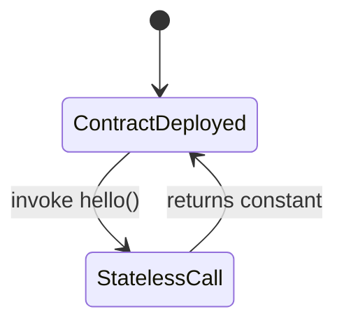

# Soroban Contract Data Model

This document describes the current on-chain data model for the Soroban workspace in `contract/`.

It is intended to make storage behavior explicit for:
- contract debugging
- off-chain indexer development
- future schema migrations
- contributor onboarding

## Scope

Contracts in this workspace:
- `arena`
- `factory`
- `payout`
- `staking`

As of this branch, all four contracts are still scaffold contracts and **do not persist any application state to Soroban storage**. They expose only a `hello()` function and do not define custom storage keys, typed storage records, TTL extensions, or instance state.

That means:
- there are currently **no storage keys**
- there are currently **no persisted value types**
- there are currently **no TTL policies in effect**
- there are currently **no read/write storage access paths**

This file still documents the present schema explicitly so indexer and contract work can evolve from a clear baseline.

## Workspace Summary

| Contract | Current public entrypoints | Uses storage? | Storage key schema | TTL policy |
| --- | --- | --- | --- | --- |
| `arena` | `hello() -> u32` | No | None | None |
| `factory` | `hello() -> u32` | No | None | None |
| `payout` | `hello() -> u32` | No | None | None |
| `staking` | `hello() -> u32` | No | None | None |

## Storage Key Inventory

There are currently no `DataKey` enums, no symbol-based keys, and no contract storage collections in the workspace.

### Arena Contract

File:
- `contract/arena/src/lib.rs`

Storage keys:
- None

Stored value types:
- None

Read patterns:
- None

Write patterns:
- None

TTL policy:
- No persistent, temporary, or instance storage is used
- No TTL extension or bump logic exists

### Factory Contract

File:
- `contract/factory/src/lib.rs`

Storage keys:
- None

Stored value types:
- None

Read patterns:
- None

Write patterns:
- None

TTL policy:
- No persistent, temporary, or instance storage is used
- No TTL extension or bump logic exists

### Payout Contract

File:
- `contract/payout/src/lib.rs`

Storage keys:
- None

Stored value types:
- None

Read patterns:
- None

Write patterns:
- None

TTL policy:
- No persistent, temporary, or instance storage is used
- No TTL extension or bump logic exists

### Staking Contract

File:
- `contract/staking/src/lib.rs`

Storage keys:
- None

Stored value types:
- None

Read patterns:
- None

Write patterns:
- None

TTL policy:
- No persistent, temporary, or instance storage is used
- No TTL extension or bump logic exists

## Access Pattern Matrix

| Contract | Storage read operations | Storage write operations | Notes |
| --- | --- | --- | --- |
| `arena` | None | None | Stateless scaffold contract |
| `factory` | None | None | Stateless scaffold contract |
| `payout` | None | None | Stateless scaffold contract |
| `staking` | None | None | Stateless scaffold contract |

## TTL Policy Baseline

Because no contract currently writes to Soroban storage:

- no keys expire
- no keys are extended
- no distinction is yet made between instance, persistent, or temporary storage
- no ledger-based retention policy exists yet

This is the baseline future stateful contract work should evolve from. Once storage is introduced, this document should be updated to include:
- key name
- key type
- value type
- storage class
- TTL bump policy
- write path
- read path

## ER-Style State Diagram

The current state machine is intentionally minimal because no on-chain round, payout, or staking state exists yet.

## Data Flow Notes

Current behavior:
- A contract is deployed
- A caller invokes `hello()`
- The contract returns a constant integer
- No state is read
- No state is written
- No state transitions are persisted

Implications for indexers:
- There is currently no contract-managed entity graph to index
- There are no storage snapshots to reconstruct
- Off-chain tooling should treat the workspace as schema-ready but state-empty

## Expected Future Documentation Shape

When real state is introduced, this document should grow to include sections such as:
- `DataKey` definitions per contract
- entity tables for arenas, rounds, submissions, payouts, stakes, and factories
- key-level TTL policies
- authorization rules by write path
- transition diagrams for round lifecycle and payout lifecycle

Until then, the accurate storage model for this workspace is:

> No custom Soroban storage keys are currently defined or used.
