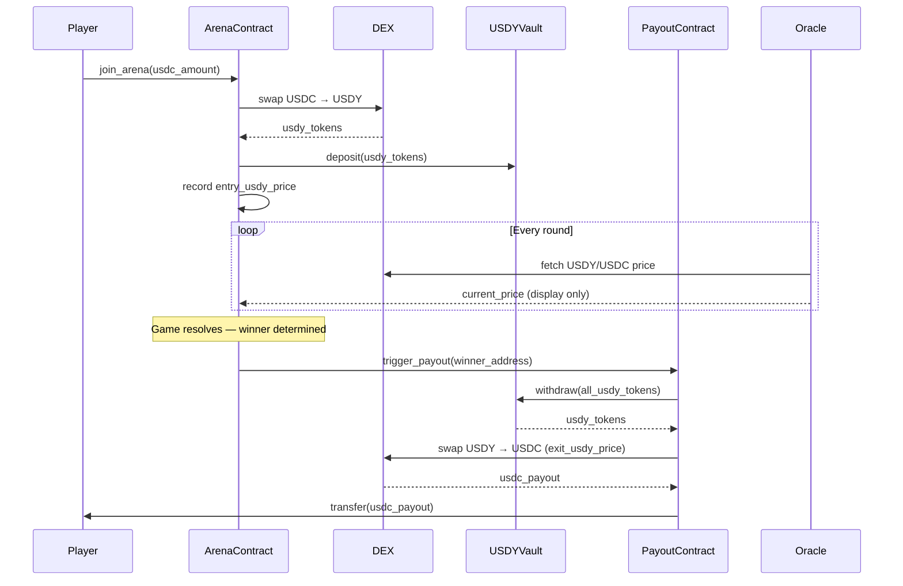

# RWA Yield Flow — End-to-End

This document describes the complete lifecycle of player funds in Inverse Arena: from the moment a player deposits an entry fee to the final prize distribution. The RWA yield mechanism is the core economic differentiator of the protocol.

---

## 1. Deposit Flow

When a player joins an arena, their entry fee is immediately put to work:

```
Player USDC
  → Soroban SAC transfer (player → arena_manager contract)
  → DEX swap: USDC → USDY (Ondo US Dollar Yield token)
  → Deposit into USDY yield vault
  → Record: entry_usdy_price = current USDY/USDC price
```

**Key detail:** The arena contract records `entry_usdy_price` at the moment of deposit. This snapshot is the baseline for yield calculation at payout time.

---

## 2. Yield Accrual Model

USDY uses a **price appreciation model**, not a rebasing model.

| Model | Mechanism |
|---|---|
| Rebasing (e.g. stETH) | Token balance increases over time |
| Price appreciation (USDY) | Token balance stays fixed; each token is worth more USDC over time |

The arena contract holds a fixed number of USDY tokens. Their USD value increases continuously as the Ondo protocol accrues yield from US Treasury bills (~5% APY). Yield is **realised** only when USDY is swapped back to USDC at withdrawal — there are no intermediate settlement steps.

---

## 3. Backend Oracle: Fetching the Current Yield Rate

The backend oracle polls the current USDY/USDC price on a configurable interval (default: every 60 seconds) via the Stellar DEX or a price feed contract:

```
GET /oracle/yield-rate
  → Query USDY/USDC price from Stellar DEX order book
  → Cache result in Redis (TTL: 60 s)
  → Expose to frontend for live "pot growth" display
```

The oracle price is **display-only**. The authoritative price used for payout is fetched on-chain at the moment the payout contract executes the USDY → USDC swap.

---

## 4. Yield Attribution

Yield accrues from the moment of deposit and is attributed to **all rounds**, not only resolved rounds. A player who is eliminated in round 1 still contributed to the yield pool for the duration they were staked.

Eliminated players' USDY shares remain in the vault — they are not withdrawn. Only the winner triggers the full vault withdrawal.

---

## 5. Payout Calculation

The winner receives the entire vault balance converted back to USDC:

```
payout_usdc = total_usdy_held × exit_usdy_price
yield_earned = payout_usdc − total_entry_fees_usdc
```

Equivalently, using the per-token price ratio:

```
payout_usdc = total_entry_fees_usdc × (exit_usdy_price / entry_usdy_price)
```

### Worked Example

| Parameter | Value |
|---|---|
| Players | 100 |
| Entry fee per player | 10 USDC |
| Total entry fees | 1,000 USDC |
| USDY price at deposit | 1.0200 USDC/USDY |
| USDY tokens acquired | 980.39 USDY |
| Game duration | 2 hours |
| USDY price at payout | 1.0212 USDC/USDY |
| **Winner payout** | **980.39 × 1.0212 = 1,001.17 USDC** |
| **Yield earned** | **1.17 USDC (~0.117% over 2 h ≈ 5.1% APY)** |

---

## 6. Sequence Diagram



---

## 7. Edge Cases

### 7.1 Tie Game (Equal Heads/Tails Split)

If a round produces an exact 50/50 split, the `random_engine` contract uses ledger-based entropy to break the tie deterministically. One side is designated the minority and advances. No special yield handling is required.

### 7.2 Arena Cancelled Before Start

If an arena is cancelled before the first round begins (e.g. minimum player count not reached within the lobby timeout):

1. The payout contract calls `cancel_arena()`.
2. All USDY is swapped back to USDC immediately.
3. Each player receives their original entry fee in USDC.
4. Any yield accrued during the lobby period is distributed pro-rata to depositors (not forfeited).

### 7.3 No Winner (All Players Eliminated Simultaneously)

This is prevented at the contract level: the `arena_manager` guarantees at least one survivor per round by using the minority rule. If all remaining players choose the same side, the `random_engine` selects a random subset as the "minority" to advance.

### 7.4 USDY Depeg / Liquidity Crisis

The `rwa_adapter` contract enforces a minimum acceptable swap price (slippage guard). If the DEX quote falls below `entry_usdy_price × 0.99` (1% slippage tolerance), the payout transaction reverts and the backend worker retries with exponential backoff. Operators are alerted via Sentry.

---

## 8. Contract Responsibilities

| Contract | Role in Yield Flow |
|---|---|
| `arena_manager.rs` | Records `entry_usdy_price`; holds USDY during game |
| `rwa_adapter.rs` | Executes USDC↔USDY swaps via Stellar DEX |
| `payout.rs` | Triggers final withdrawal and winner transfer |
| `random_engine.rs` | Tie-breaking; does not interact with yield |

---

## Related Documents

- [Contract Architecture](../contract/ARCHITECTURE.md)
- [Payout Contract](../contract/CONTRACTS.md)
- [Arena State Integration](../frontend/docs/ARENA_STATE_INTEGRATION.md)
